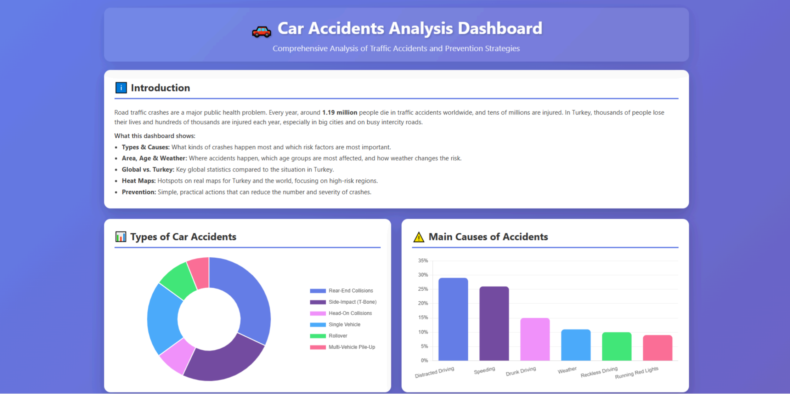
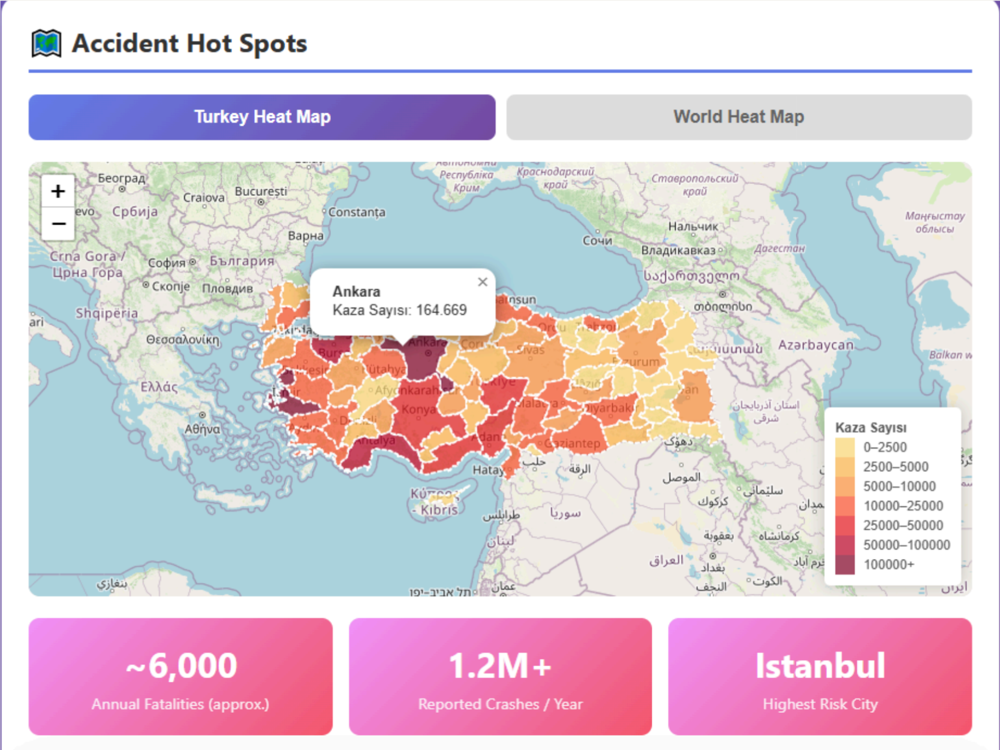
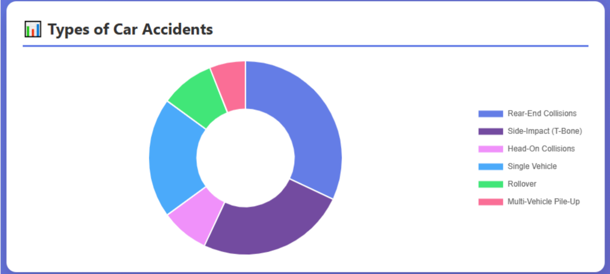
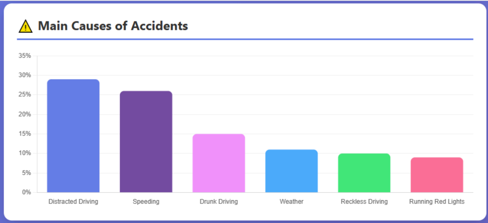
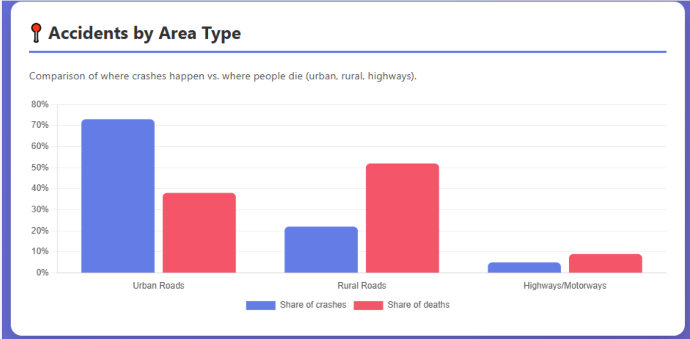
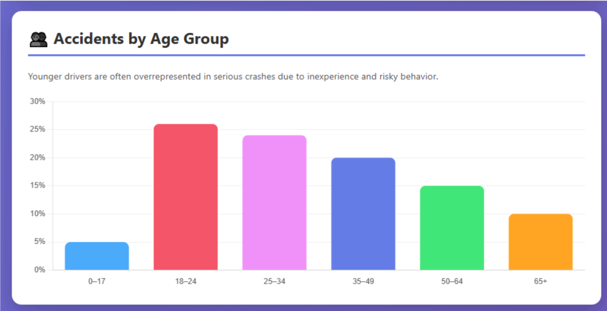
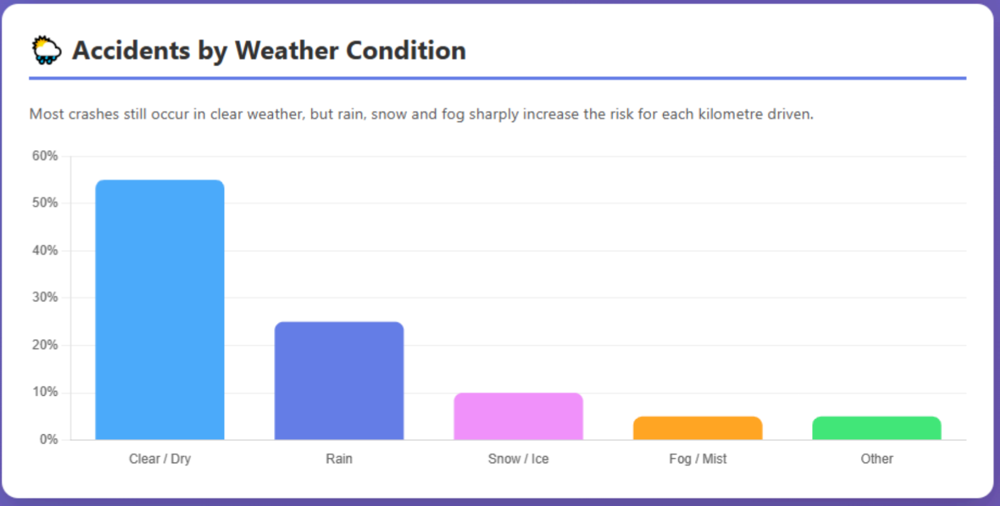

# Car-Accidents-Analysis-Dashboard
Interactive traffic accident analysis dashboard providing insights into trends, risk factors, and safety through data visualization.
## Live Demo
https://caraccidentsanalysisdashboard.netlify.app/

## Group Members
-2370493 - Olgu ŞİMŞİR
-23000447 - Bade Su ÖZTÜRK
-2300463 - Elif Bilge Yavuz
-23000438 - Ata METİN
-23000452 - Berat SAKARYA

## Abstract
Traffic accidents have remained an area of global concern for road safety with significant
loss of life and economic costs every year. High levels of awareness with regard to traffic
accidents and their causes are critical in the effort to curb the occurrence of traffic
accidents. This project is titled Car Accidents Analysis Dashboard and aims to enhance
traffic road safety awareness through the analysis of traffic accidents using an online
dashboard. From the dashboard, accidents can be accessed both globally and nationally
with a keen focus on the causes of the accidents as well as the age groups and
environmental factors. Various graphical components are applied in the project to
interpret traffic accidents in an understandable manner. From the analysis performed
using the dashboard, various emerging trends are arrived at in relation to driver behavior
and the influence of weather and regions. It becomes evident from the analysis that traffic
safety in traffic accidents can be achieved through the strict observance of speed limits,
the avoidance of distractions when driving, the use of seatbelts when in the car, and the
modification of driving according to the environmental conditions of the roads and
weather. In conclusion, the Car Accidents Analysis Dashboard remains an appropriate
learning tool for traffic road safety awareness to curb traffic accidents.

## Problem Statement
Analysis of the Car Accidents Analysis Dashboard reveals that traffic accidents remain a
critical safety problem, with a high concentration of crashes occurring under specific
conditions. The dashboard data indicates that urban areas experience the highest number
of accidents which tend to occur when weather conditions are bad and traffic volume is
high. Young and middle-aged drivers experience most traffic accidents according to data
which shows that pedestrians and cyclists become more vulnerable to accidents in areas
that heatmap analysis has determined as high-accident zones. The research shows that
driver-related factors which include speeding and distracted driving create the most
dangerous situations which lead to accidents and make them more severe. The data
remains accessible yet most road users remain unaware about these patterns which
results in dangerous driving habits that cause unnecessary traffic accidents. The public
faces an ongoing public safety threat because people lack understanding about traffic
accidents which requires the creation of basic visual tools that display accident locations
and their causes and risk factors.

## Objective
The objectives of this project are:
- To analyze the traffic accident data presented in the Car Accidents Analysis
Dashboard in order to identify key patterns related to accident causes, age
groups, weather conditions, and geographic locations.
- To visualize high-risk areas and accident trends using interactive charts and
heatmaps to improve understanding of traffic accident distribution.
- To increase traffic safety awareness by highlighting critical risk factors and
promoting safer driving behaviors based on dashboard findings.

## Background
Traffic accidents have become a worldwide public health crisis because they continue to
be the primary reason for fatal and non-fatal injuries across the globe. Research about
traffic safety which took place before this study demonstrated that accidents result from
speeding and distracted driving and weather conditions and road design and driver age.
Research shows that urban traffic density leads to more accidents throughout cities while
pedestrians and cyclists become more exposed to danger when they use areas with heavy
vehicle traffic. The research results demonstrate why accident data analysis remains
essential because it helps identify dangerous factors which lead to better traffic safety
results.
The reduction of traffic accidents has become possible through multiple solutions which
include enhanced traffic rules and better road planning and speed limit enforcement and
public safety initiatives and safety technology implementation of seatbelts and advanced
driver assistance systems. The public along with policymakers now use data-driven
methods and visualization tools to understand complex accident information better.
Users can detect patterns and perform regional assessments and identify dangerous
situations through dashboard and analytical platform tools which go beyond basic data
inspection.
The Car Accidents Analysis Dashboard serves this field through its interactive visual
interface which unites accident data with geographical and environmental context. The
dashboard presents data through charts and maps and heatmaps which enable users to
study accident patterns based on location and age groups and weather conditions and
accident causes. The method enhances public access to traffic safety information which
enables better understanding of the data for improved decision-making processes.
The project transforms large amounts of accident data into easy-to-understand visual
presentations through data visualization techniques. The analysis shows different levels
of connection through data organization and spatial visualization and pattern evaluation
which reveals the most dangerous situations. The system combines detailed traffic data
with safety education functions through its design which connects technical systems to
user-friendly interfaces.
## Methodology
The research used data analytics to visualize traffic accidents while performing their
analysis. The first requirement needed me to retrieve traffic accident data from official
public databases which provided reliable information. The data contained details about
accident sites and their causes and the involved age ranges and weather elements and the
extent of accidents. The review process confirmed that these datasets match the
dashboard objectives for the Car Accidents Analysis Dashboard.
The research team prepared the collected data for analysis through the creation of ready-
to-analyze formats after finishing data collection activities. The analysis required me to
group accidents according to their main characteristics which included driver age and
environmental elements and location information. The process of basic data cleaning
needed two operations to eliminate wrong data entries while it made all data points

consistent throughout the dataset. The dashboard received its main data input from the
cleaned information.
The analysis phase demanded researchers to detect patterns and trends which existed in
their gathered data. The research used descriptive analysis methods to study accidents
through three main objectives which included accident rate assessment and identification
of dangerous age brackets and determination of frequent accident triggers. The research
applied mapping and heatmap visualizations for geographic analysis to identify accident
hotspots and determine risk levels in various geographic areas. The methods enabled
researchers to determine which specific locations and environmental factors led to
increased accident occurrences.
The dashboard operates as a web-based visualization system which uses modern data
visualization techniques for its operations. The presentation of analyzed data used
interactive charts and maps and graphical elements which created an easy-to-understand
interface for users. The project timeline consisted of four stages which started with data
collection followed by data preparation and then visualization development before
finishing with result interpretation. The project can be duplicated through this systematic
approach by using identical traffic accident data and visualization software to enhance
traffic safety education programs.

Figure 1. Main interface of the Car Accidents Analysis Dashboard.

Figure 2. Traffic accident heatmap showing high-risk regions in Turkey.

## Results
The Car Accidents Analysis Dashboard provides a detailed summary of traffic accident
information which researchers obtained from various geographic areas. The visual
analysis reveals that urban areas experience more traffic accidents than rural areas
because accidents tend to happen in areas where people gather and traffic density is
elevated. The Heatmap visualization tool shows which areas in Turkey experience the
most accidents throughout major cities and their surrounding regions and across
worldwide locations based on their accident intensity levels.
The dashboard shows that driver-related factors appear most frequently as causes of
traffic accidents according to its categorical charts. The accident cause data indicates that
speeding incidents and distracted driving accidents occur more often than all other
documented factors. The analysis of different age groups shows that drivers between 18
and 45 years old participate in most accidents compared to all other age groups. The
dashboard shows these patterns which appear throughout all areas of the dashboard.

The data about environmental conditions shows that weather conditions directly affect
the number of traffic accidents which occur. The results show an increase in accident
frequency during adverse weather conditions such as rain and reduced visibility when
compared to clear weather. The research findings receive support from visual charts
which show accident patterns between different environmental conditions to
demonstrate how weather elements affect accident statistics.

Figure 3. Distribution of different types of car accidents.

Figure 4. Main causes of traffic accidents based on dashboard data.

Figure 5. Distribution of traffic accidents by area type.

## Discussion
The Car Accidents Analysis Dashboard produced results which fulfilled all project
objectives by revealing essential patterns about accident origins and dangerous age
brackets and weather factors and accident-prone locations. The visual presentation of
charts and heatmaps demonstrates that driver actions together with outside conditions
determine accident frequencies which supports the project's goal to educate about traffic
safety through fundamental data visualization techniques.
The research findings about traffic safety patterns match what other studies in this field
have already discovered. Research conducted before this study shows that speeding
together with distracted driving practices result in most traffic accidents which occur in
cities. The traffic safety research literature supports the expected results which show
young and middle-aged drivers participate more in accidents during bad weather
conditions.
The project contains specific restrictions which limit its operation. The research depends
on the quality and availability of accident data which shows different levels of consistency
between different areas and time spans. The dashboard performs descriptive analysis but
does not include predictive modeling which makes it impossible for users to perform
causal analysis. The study reveals that accidents tend to occur in particular urban areas
which requires authorities to establish specific safety protocols and enhance traffic
control systems and deliver targeted public education initiatives. The research results

show that data visualization tools help users make better traffic safety management
choices because of their useful capabilities.

## Conclusion
The Car Accidents Analysis Dashboard solved the ongoing traffic accident problem
through data processing of accident information which used analytical methods to create
visual presentations. The research aimed to discover vital patterns which showed accident
origins and revealed which age segments faced most danger and how weather conditions
influenced accidents and which locations saw the most accidents to improve traffic safety
understanding. The project reached its objectives because it successfully transformed
complex accident information into user-friendly visual elements which users could
engage with.
The research reveals that traffic accidents happen most often in cities with heavy traffic
while driver errors from speeding and distracted driving represent the leading causes of
accidents. Young and middle-aged drivers were responsible for most accidents according
to the study which also showed that bad weather made accidents more likely to happen.
The Heatmap visualizations showed accident hotspots which helped analysts understand
how risk patterns distribute across different locations.
The research data allows us to create various operational recommendations which will
boost traffic safety performance. The solution includes three main components which
consist of enhanced traffic rule enforcement in dangerous zones and expanded public
education about safe driving practices and enhanced traffic control systems for cities. The
dashboard requires future development to incorporate additional detailed and up-to-date
data sources which will expand its geographical scope and predictive models to improve
accident prevention and decision-making abilities.

## References
- Emniyet Genel Müdürlüğü. (2023). Trafik kazaları istatistikleri. T.C. İçişleri
Bakanlığı. https://www.egm.gov.tr/trafik-istatistikleri
- Karayolları Genel Müdürlüğü. (2022). Türkiye karayolu ağı ve trafik güvenliği
raporu. T.C. Ulaştırma ve Altyapı Bakanlığı. https://www.kgm.gov.tr

- National Highway Traffic Safety Administration. (2024). Traffic safety facts 2023.
NHTSA. https://www.nhtsa.gov/research-data/fatality-analysis-reporting-syste
m-fars
- Türkiye İstatistik Kurumu. (2023). Karayolu trafik kaza istatistikleri, 2022. TÜİK.
https://data.tuik.gov.tr
- World Health Organization. (2023, December 13). Road traffic injuries. WHO. htt
ps://www.who.int/news-room/fact-sheets/detail/road-traffic-injuries
## Appendices

Figure 6. Distribution of traffic accidents by age group, showing higher accident involvement
among young and middle-aged drivers compared to other age categories.

Figure 7. Distribution of traffic accidents by weather condition, indicating that while most
accidents occur in clear weather, adverse conditions such as rain, snow, and fog increase
accident risk.

